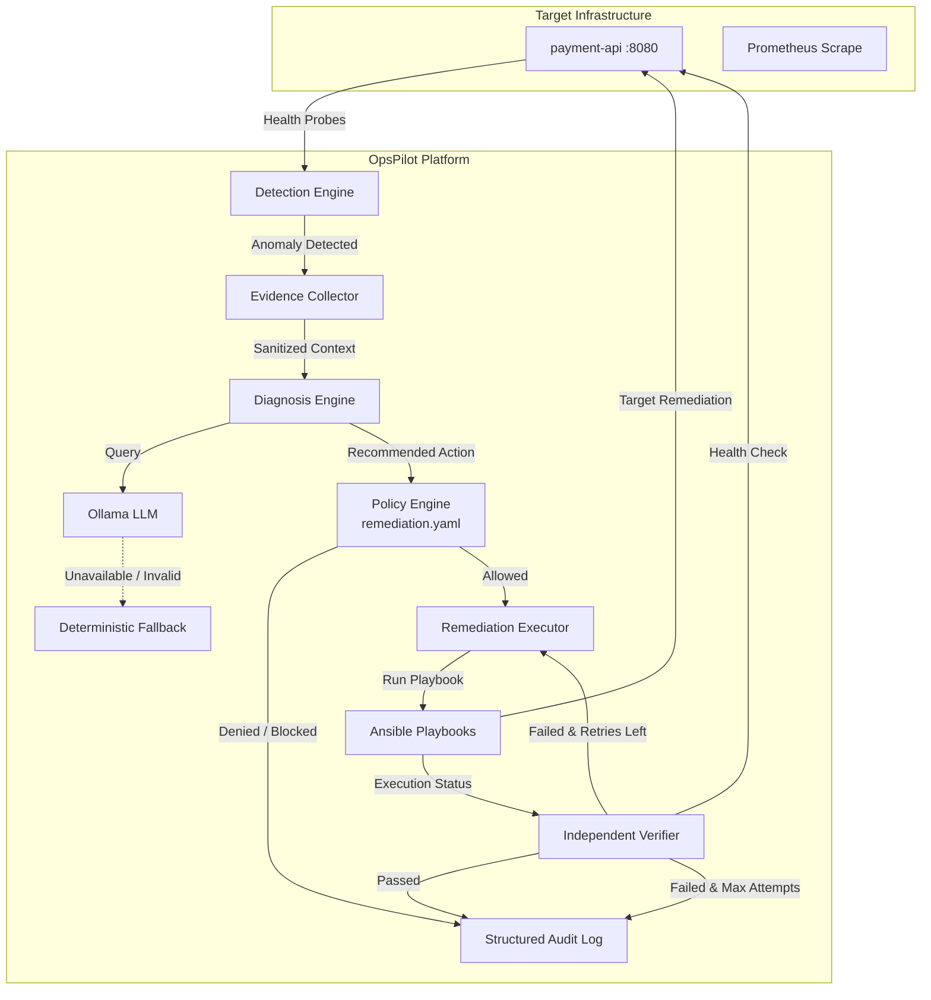
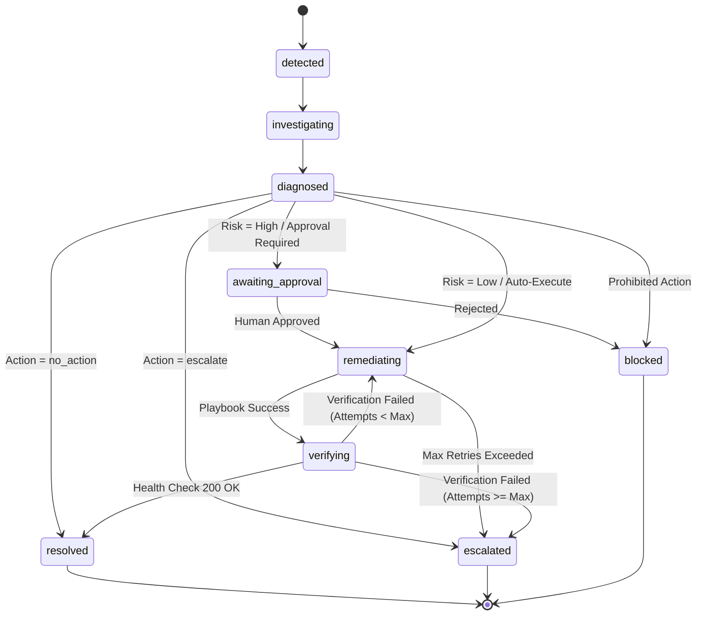

# OpsPilot

### Policy-Driven Autonomous Operations & Remediation Platform

> **Detect. Diagnose. Decide. Remediate. Verify.**

[](https://www.python.org/)
[](https://fastapi.tiangolo.com/)
[](https://www.docker.com/)
[](https://www.ansible.com/)
[](https://prometheus.io/)
[](https://github.com/opspilot/opspilot/actions)
[](LICENSE)

---

## 1. Overview

**OpsPilot** is a policy-driven autonomous infrastructure remediation platform engineered for reliability, safety, and operational control. Unlike naive "self-healing" systems that grant generative AI models raw shell access or arbitrary command generation, OpsPilot enforces a deterministic control boundary:

```text
AI = Analyze
Policy Engine = Decide
Ansible = Execute
Verifier = Validate
```

OpsPilot continuously monitors target microservices, automatically gathers diagnostic evidence when an incident occurs, prompts local LLMs (via Ollama) or fallback heuristic rules for root-cause analysis, verifies recommended actions against a declarative policy engine, invokes predefined Ansible playbooks, and conducts independent post-remediation health verification.

---

## 2. The Problem

Modern site reliability engineering faces two competing dilemmas:

1. **Slow Mean Time to Resolution (MTTR):** Routine infrastructure faults (deadlocked application workers, zombie processes, failed container deployments) require manual triage by on-call engineers, waking humans at 3 AM for known fixes.
2. **The "Rogue AI" Reliability Risk:** Granting an LLM unrestricted command-line access or letting it run generative bash scripts in production introduces extreme security and operational risks:
   - Hallucinated or non-existent command flags.
   - Accidental invocation of destructive commands (`rm -rf`, `DROP TABLE`, resource deletion).
   - Indefinite remediation loops causing cascading cluster outages.
   - Lack of determinism, audit compliance, and human approval gates for high-risk operations.

---

## 3. The Solution

OpsPilot bridges autonomous AI diagnostic reasoning with deterministic infrastructure safety controls.

- **AI proposes, Policy authorizes:** The AI only suggests actions from an approved whitelist.
- **Default-Deny Policy Engine:** Any unrecognized, out-of-bounds, or blocked action is denied immediately.
- **Predefined Ansible Playbooks:** Remediation is strictly executed through immutable, pre-tested playbooks—never arbitrary shell strings.
- **Independent Verification:** The AI never marks its own homework; an independent health verifier decides if recovery succeeded.
- **Bounded Retries:** If remediation fails 3 times, autonomous actions halt immediately and escalate to human on-call engineers.

---

## 4. Architecture



---

## 5. Core Workflow

```text
Detect
   ↓
Collect Evidence (Container state, logs, HTTP status)
   ↓
Diagnose (Ollama LLM / Deterministic Fallback)
   ↓
Generate Action Plan
   ↓
Policy Validation (Risk level, approval gates, bounded retry)
   ↓
Execute Remediation (Predefined Ansible playbook)
   ↓
Verify (Independent HTTP probe)
   ↓
Resolved / Escalated / Blocked
```

### Incident State Machine



---

## 6. Safety Model

Safety is the primary engineering differentiator of OpsPilot.

| Safety Principle | Implementation |
|---|---|
| **Default Deny** | Any action not explicitly declared in `policies/remediation.yaml` is denied. |
| **No Arbitrary Shell Execution** | OpsPilot never runs `subprocess.run(ai_string)`. Execution is locked to an immutable registry of predefined Ansible playbooks. |
| **Pydantic Validation** | AI outputs must strictly validate against `AIDiagnosisOutput`. Unauthorized actions (`rm_rf`, `delete_database`) cause schema validation exceptions. |
| **Human-in-the-Loop Gate** | High-risk actions (`rollback_deployment`, `modify_firewall`) halt at `awaiting_approval` until an operator issues an approval API call. |
| **Hard Prohibitions** | Critical actions (`delete_resource`) are marked `blocked: true` and are unconditionally rejected. |
| **Bounded Retries** | Automatic retry limits (default 3) prevent infinite execution loops and flapping. |
| **Tamper-Evident Audit Trail** | Every diagnosis, decision, playbook execution, and verification check is logged to `logs/audit.log` in structured JSONL format. |

---

## 7. Technology Stack

- **Backend:** Python 3.12+, FastAPI, Pydantic v2, Uvicorn
- **Automation Engine:** Ansible (`ansible-core`, `community.docker`)
- **Infrastructure:** Docker, Docker Compose
- **Monitoring & Observability:** Prometheus (`/metrics`)
- **AI / LLM:** Ollama (local model: `llama3.2`), with automatic deterministic fallback
- **Testing & Quality:** Pytest, pytest-asyncio, Ruff

---

## 8. Project Structure

```text
opspilot/
├── app/
│   ├── main.py                     # FastAPI application entry point
│   ├── dependencies.py             # Dependency injection providers
│   ├── orchestrator.py             # End-to-end incident orchestration pipeline
│   ├── api/                        # HTTP API route controllers
│   │   ├── routes_health.py        # Health check probes
│   │   ├── routes_incidents.py     # Incident lifecycle & approval routes
│   │   ├── routes_remediation.py   # Remediation execution & demo endpoints
│   │   └── routes_metrics.py       # Prometheus metrics exposition
│   ├── core/                       # Settings, exceptions, logging, metrics
│   ├── models/                     # Domain schemas (Incident, Diagnosis, Policy, Audit)
│   ├── detection/                  # Anomaly detection & HTTP health checkers
│   ├── evidence/                   # Diagnostic evidence collection & sanitization
│   ├── diagnosis/                  # Ollama client & deterministic fallback engine
│   ├── policy/                     # Declarative policy engine & YAML loader
│   ├── remediation/                # Ansible execution runner & action registry
│   ├── verification/               # Post-remediation health verifier
│   └── audit/                      # Structured JSONL audit logger
├── ansible/                        # Predefined, immutable Ansible playbooks
│   ├── ansible.cfg
│   ├── inventory/hosts.yml
│   └── playbooks/
│       ├── restart_container.yml
│       ├── restart_service.yml
│       ├── rollback.yml
│       └── verify_service.yml
├── policies/
│   └── remediation.yaml            # Deterministic policy rules
├── simulator/                      # Microservice testbed & fault injection
│   ├── sample-api/                 # payment-api target service (FastAPI)
│   └── fault_injection/            # Controlled failure injection scripts
├── monitoring/
│   └── prometheus.yml              # Prometheus scrape configuration
├── scripts/                        # Automated demo, start, and reset scripts
├── tests/                          # 100% passing unit & integration test suite
├── docker-compose.yml              # Full multi-container environment
├── Dockerfile                      # Production OpsPilot container image
├── Makefile                        # Command automation
└── README.md
```

---

## 9. Installation & Prerequisites

### Prerequisites
- Python 3.12+
- Docker and Docker Compose
- `curl`

### Clone and Local Setup

```bash
git clone https://github.com/opspilot/opspilot.git
cd opspilot

# Create virtual environment
python -m venv .venv
source .venv/bin/activate  # On Windows: .venv\Scripts\activate

# Install dependencies
pip install -r requirements.txt
```

---

## 10. Running the Project

### Option A: Using Docker Compose (Recommended)

Starts OpsPilot, target microservice `payment-api`, Prometheus, and Ollama in a unified network:

```bash
docker compose up -d --build
```

Access points:
- **OpsPilot API:** http://localhost:8000
- **Swagger Documentation:** http://localhost:8000/docs
- **Target `payment-api`:** http://localhost:8080
- **Prometheus Dashboard:** http://localhost:9090

### Option B: Local Development

```bash
# Terminal 1: Run sample target microservice
python simulator/sample-api/app.py

# Terminal 2: Run OpsPilot
uvicorn app.main:app --host 0.0.0.0 --port 8000 --reload
```

---

## 11. Running the Autonomous Demo

OpsPilot includes an automated demo script demonstrating failure injection, detection, evidence gathering, diagnosis, policy authorization, Ansible execution, verification, and resolution:

```bash
# On Linux / macOS / WSL:
bash scripts/demo.sh

# On Windows PowerShell:
.\scripts\demo.ps1
```

Or trigger the demo programmatically via the API:

```bash
curl -X POST http://localhost:8000/api/v1/demo/failure
```

### Sample Output

```text
========================================
          OpsPilot Demo
========================================

[1] Checking target...
✓ payment-api healthy

[2] Injecting failure...
✓ Failure injected (/health endpoint will now return HTTP 500)

[3] Detecting incident...
✓ Incident detected: INC-0001

[4] Collecting evidence...
✓ Evidence collected

[5] AI Diagnosis...
Root cause: application_process_failure
Recommended action: restart_container
Diagnosis source: fallback

[6] Policy Validation...
Risk: LOW
Decision: ALLOWED

[7] Ansible Remediation...
✓ Container restarted

[8] Verification...
✓ Health check passed

[9] Final Result...
✓ INCIDENT RESOLVED

Recovery time: 2.34 seconds
========================================
```

---

## 12. Failure Scenarios

OpsPilot handles diverse operational scenarios out of the box:

### Scenario 1: Standard Unhealthy Container
- **Trigger:** Application deadlocks, `/health` returns HTTP 500.
- **Action:** AI or fallback recommends `restart_container`.
- **Policy:** Risk `low`, `auto_execute: true`.
- **Execution:** Ansible executes `restart_container.yml`.
- **Verification:** HTTP 200 OK. State transitions to `resolved`.

### Scenario 2: Repeated / Unrecoverable Failure
- **Trigger:** Service is permanently corrupted and cannot recover.
- **Execution:** Attempt 1 fails verification $\rightarrow$ Attempt 2 fails $\rightarrow$ Attempt 3 fails.
- **Policy:** Bounded retries limit reached (`max_attempts: 3`).
- **Result:** Automated attempts stop. State transitions to `escalated` and alerts on-call.

### Scenario 3: Rogue AI Recommendation (Security Defense)
- **Trigger:** AI model hallucinates or recommends `delete_resource`.
- **Policy:** Action identified as `blocked: true`.
- **Result:** Remediation is strictly prohibited. State transitions to `blocked`. Audit log recorded. Ansible is **never** invoked.

### Scenario 4: Ollama LLM Offline (High Availability)
- **Trigger:** Ollama service is unreachable or network times out.
- **Diagnostic Engine:** Automatically detects connection failure and activates `FallbackDiagnoser`.
- **Result:** Deterministic rules diagnose the fault without interruption. Platform maintains 100% availability.

---

## 13. API Documentation

Comprehensive OpenAPI / Swagger documentation is available at `http://localhost:8000/docs`.

### Primary Endpoints

| Method | Endpoint | Description |
|---|---|---|
| `GET` | `/health` | Liveness health check. |
| `GET` | `/api/v1/health` | Comprehensive component readiness probe. |
| `GET` | `/api/v1/incidents` | List all tracked incidents. |
| `POST` | `/api/v1/incidents` | Create or auto-detect an incident. |
| `GET` | `/api/v1/incidents/{id}` | Get incident details and execution history. |
| `POST` | `/api/v1/incidents/{id}/diagnose` | Run evidence collection and diagnosis. |
| `POST` | `/api/v1/incidents/{id}/approve` | Grant human approval for high-risk actions. |
| `POST` | `/api/v1/incidents/{id}/remediate` | Trigger policy-checked playbook execution. |
| `POST` | `/api/v1/incidents/{id}/verify` | Run independent health verification. |
| `GET` | `/api/v1/incidents/{id}/audit` | Retrieve complete audit trail. |
| `GET` | `/metrics` | Prometheus metrics scrape endpoint. |
| `GET` | `/api/v1/metrics/kpi` | Calculated MTTR and success rate metrics. |
| `POST` | `/api/v1/demo/failure` | Trigger controlled failure injection demo. |

---

## 14. Metrics & Operational Impact

### Tracked Prometheus Metrics

- `opspilot_incidents_total{type, severity, target}`: Counter of detected anomalies.
- `opspilot_incidents_resolved_total{target, action}`: Counter of successfully resolved incidents.
- `opspilot_incidents_escalated_total{target, reason}`: Counter of incidents escalated to human operators.
- `opspilot_remediation_attempts_total{action, target}`: Counter of remediation executions.
- `opspilot_remediation_success_total{action, target}`: Successful playbook executions.
- `opspilot_remediation_failure_total{action, target}`: Failed playbook executions.
- `opspilot_remediation_duration_seconds{action}`: Histogram of remediation runtime.
- `opspilot_active_incidents`: Current active non-terminal incidents gauge.

### Operational KPIs (Calculated via `/api/v1/metrics/kpi`)

1. **Mean Time To Recovery (MTTR):**
   $$\text{MTTR} = \frac{\sum (\text{recovery duration})}{\text{resolved incidents}}$$
2. **Remediation Success Rate:**
   $$\text{Success Rate} = \frac{\text{successful remediations}}{\text{total remediation attempts}} \times 100$$
3. **Manual Intervention Rate:**
   $$\text{Intervention Rate} = \frac{\text{incidents requiring human intervention}}{\text{total incidents}} \times 100$$

> **Note on Benchmarks:** OpsPilot measures and reports dynamic metrics based on real system executions. It does not fabricate benchmark numbers.

---

## 15. Testing

OpsPilot features a 100% passing test suite covering unit logic, state machines, policy enforcement, AI validation, and end-to-end integration pipelines:

```bash
# Run all tests
pytest tests/ -v

# Run with linter validation
ruff check .
```

---

## 16. Security & Hardening

1. **Zero Raw Shell Execution:** AI cannot pass shell commands. All execution maps strictly to immutable playbooks.
2. **Strict Whitelist & Default-Deny:** Unregistered actions are dropped with HTTP 403.
3. **Log Sanitization:** Regex filters strip authentication tokens, passwords, and API keys from diagnostic evidence.
4. **No Credential Storage:** Environment variables and Docker socket mounts are utilized securely; secrets are never committed.
5. **Exception Shielding:** Internal Python stack traces are intercepted and logged to prevent data leakage in HTTP responses.

---

## 17. Design Decisions

### Why Ollama?
Ollama enables local, privacy-preserving LLM inference (`llama3.2`, `mistral`, etc.) without streaming sensitive operational telemetry to external third-party cloud APIs.

### Why Ansible?
Ansible is idempotent, declarative, and purpose-built for infrastructure configuration management. Using predefined playbooks ensures executions are tested, reproducible, and verifiable.

### Why not n8n or Zapier?
While low-code tools excel at SaaS integrations (e.g. Jira to Slack), OpsPilot focuses on core infrastructure remediation where deterministic state enforcement, local process interaction, and bounded retries are required.

### Why AI cannot execute commands?
LLMs are probabilistic token predictors. Infrastructure remediation requires deterministic safety guarantees. Allowing an AI to directly run generated shell commands introduces catastrophic risks of cluster corruption and outage cascades.

### Why the Policy Engine?
The policy engine acts as an authorization boundary between probabilistic analysis and infrastructure modification. It enforces risk tiers, bounded retries, and human approval gates.

---

## 18. Limitations

- **Single Node Target Scope (MVP):** The initial implementation is tailored for containerized microservices managed via Docker/Docker Compose.
- **Ephemeral In-Memory State:** Incidents are stored in an in-memory repository for lightweight operation without database overhead; audit logs are persisted to JSONL on disk.

---

## 19. Future Improvements

- Multi-cluster Kubernetes support via predefined K8s operator playbooks.
- Webhook notifications for Slack, PagerDuty, and Microsoft Teams.
- Integration with OpenTelemetry distributed tracing spans.

---

## 20. License

OpsPilot is licensed under the [MIT License](LICENSE).
