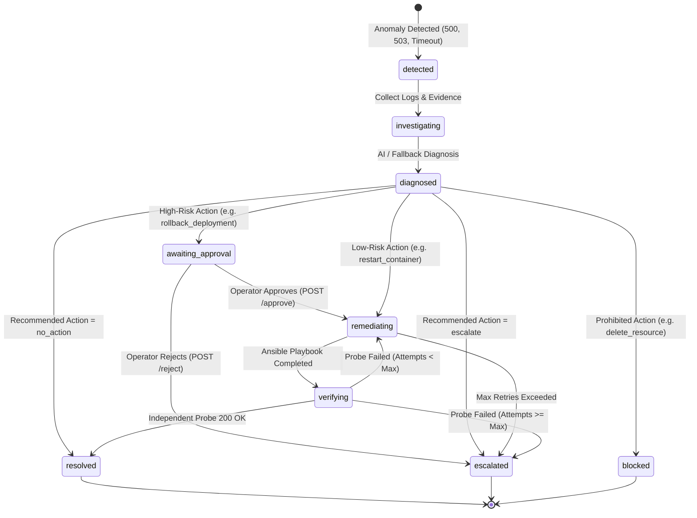

# OpsPilot

### Policy-Driven Autonomous Operations & Remediation Platform

> **Detect. Diagnose. Decide. Remediate. Verify.**

[](https://www.python.org/)
[](https://fastapi.tiangolo.com/)
[](https://www.docker.com/)
[](https://www.ansible.com/)
[](https://prometheus.io/)
[](tests/)
[](https://github.com/astral-sh/ruff)
[](LICENSE)

---

## 1. Overview

**OpsPilot** is an open-source, policy-driven autonomous incident response and remediation platform designed for modern Site Reliability Engineering (SRE). Unlike naive self-healing systems that grant generative AI models raw shell access or unconstrained terminal execution, OpsPilot enforces a **deterministic control boundary**:

```text
AI = Analyze (Reason about telemetry and logs)
Policy Engine = Decide (Enforce safety rules, risk tiers, and approval gates)
Ansible = Execute (Run pre-tested, immutable playbooks)
Verifier = Validate (Independent health checks — AI never grades its own homework)
```

OpsPilot continuously monitors target services, automatically collects sanitized diagnostic evidence during anomalies, queries local LLMs (via Ollama `llama3.2`) or fallback heuristics for root-cause analysis, evaluates actions against declarative policies (`remediation.yaml`), executes predefined Ansible playbooks, and conducts independent verification to restore healthy state.

---

## 2. The Problem: The "Rogue AI" Reliability Risk

Modern SRE teams face two opposing challenges:

1. **Slow Mean Time to Recovery (MTTR):** Routine infrastructure issues (deadlocked application workers, zombie processes, failed container deployments) wake on-call engineers at 3 AM for known fixes.
2. **The "Rogue AI" Threat in Production:** Giving an LLM direct shell or bash generation permissions introduces catastrophic operational and security risks:
   - **Hallucinated parameters:** Running invalid flags or corrupting configurations.
   - **Accidental destruction:** Executing destructive commands (`rm -rf`, `DROP TABLE`, or deleting cloud resources).
   - **Cascading flapping loops:** Infinite retry loops that crash entire clusters.
   - **Lack of auditability:** No deterministic audit trail or human approval gates for high-risk operations.

---

## 3. The OpsPilot Solution

OpsPilot pairs probabilistic AI diagnostic reasoning with deterministic infrastructure safety controls:

- **AI proposes, Policy authorizes:** The AI model is strictly restricted to an approved action whitelist.
- **Default-Deny Policy Engine:** Any unrecognized, out-of-bounds, or blocked action is rejected immediately.
- **Predefined Ansible Playbooks:** Execution is exclusively handled through immutable, pre-tested Ansible playbooks—never generated shell strings.
- **Human-in-the-Loop Approval Gates:** High-risk actions (`rollback_deployment`, `modify_firewall`) safely halt the pipeline until an authorized operator issues approval.
- **Independent Verification:** Post-remediation health is validated independently through active HTTP probes.
- **Bounded Retries:** Remediation attempts are capped (default: max 3). Unresolved incidents automatically escalate to human on-call engineers.
- **100% Local & Privacy-Preserving:** Local inference via Ollama keeps sensitive logs and telemetry inside your own infrastructure.

---

## 4. Architecture

```mermaid
flowchart TD
    subgraph Target Infrastructure
        API["payment-api :8080 (Target Microservice)"]
        Metrics["Prometheus Scrape (/metrics)"]
    end

    subgraph OpsPilot Platform
        Detect["Detection Engine (HTTP Probes)"]
        Evidence["Evidence Collector (Logs & Telemetry)"]
        Diag["Diagnosis Engine"]
        Ollama["Ollama LLM (llama3.2)"]
        Fallback["Deterministic Fallback Engine"]
        Policy["Policy Engine (remediation.yaml)"]
        Gate{"Human Approval Gate\n(High Risk Actions)"}
        Executor["Remediation Executor"]
        Ansible["Ansible Playbooks (.yml)"]
        Verify["Independent Verifier"]
        Audit["Compliance Audit Log (audit.log)"]
    end

    API -->|Health Probes| Detect
    Detect -->|Anomaly Detected| Evidence
    Evidence -->|Sanitized Context| Diag
    Diag -->|Structured Prompt| Ollama
    Ollama -.->|Connection Failure| Fallback
    Diag -->|Recommended Action| Policy
    Policy -->|Blocked / Prohibited| Audit
    Policy -->|Requires Approval| Gate
    Gate -->|Approved by Human| Executor
    Gate -->|Rejected by Human| Audit
    Policy -->|Auto-Execute (Low Risk)| Executor
    Executor -->|Run Playbook| Ansible
    Ansible -->|Execute Action| API
    Ansible -->|Execution Outcome| Verify
    Verify -->|Probe Health| API
    Verify -->|Passed| Audit
    Verify -->|Failed & Attempts Left| Executor
    Verify -->|Failed & Max Attempts| Audit
```

---

## 5. Incident Lifecycle & State Machine



---

## 6. Safety & Security Guardrails

| Guardrail | Implementation | Benefit |
|---|---|---|
| **Default-Deny Policy** | Actions must be declared in `policies/remediation.yaml` with `allowed: true`. | Unregistered actions are dropped with HTTP 403. |
| **Zero Raw Shell Execution** | OpsPilot never runs `subprocess.run(ai_string)`. Execution strictly invokes predefined Ansible playbooks. | Eliminates prompt injection, hallucinated flags, and malicious commands. |
| **Strict Pydantic Validation** | LLM outputs are forced into a strict JSON schema (`AIDiagnosisOutput`). | Malformed or out-of-schema outputs fail gracefully into fallback rules. |
| **Human-in-the-Loop Gates** | Medium/High-risk actions halt at `awaiting_approval` until human operator approval via Dashboard or API. | Prevents unintended rollbacks or network modifications without consent. |
| **Hard Prohibitions** | Dangerous actions (e.g., `delete_resource`) are marked `blocked: true`. | Zero execution regardless of AI confidence score. |
| **Bounded Retries** | Limits attempts (default: 3) before halting and escalating. | Prevents flapping, cascading restarts, and infinite remediation loops. |
| **Sanitized Telemetry** | Automated regex masking strips tokens, secrets, and API keys. | Ensures zero sensitive data leakage in logs or LLM prompts. |
| **Compliance Audit Trail** | Every diagnosis, policy check, playbook result, and verification is logged in structured JSONL. | Complete traceability for SOC2 and security compliance. |

---

## 7. Interactive Web Dashboard

OpsPilot includes a modern, light-theme operations dashboard available at **`http://localhost:8000/dashboard`**.

> Dashboard preview image is not bundled in this repository.  
> Open `http://localhost:8000/dashboard` after startup to see the live UI.

### Key Features
1. **Live System Health Chips:** Real-time visual status monitoring of the target microservice (`payment-api`) and local AI provider (`Ollama`).
2. **Operational KPI Cards:** Dynamic tracking of **Total Incidents**, **Remediation Success Rate**, **MTTR (Mean Time To Recovery)**, and **Policy Blocks**.
3. **Interactive Visual Pipeline Stepper:** Step-by-step progress tracking across all 6 stages (`Detect` $\rightarrow$ `Evidence` $\rightarrow$ `Diagnose` $\rightarrow$ `Policy` $\rightarrow$ `Remediate` $\rightarrow$ `Verify`).
4. **Simulator Sandbox & Failure Modal:** Inject realistic simulated failure modes:
   - **Bad Deployment (v2.0.0 · 503):** Triggers `rollback_deployment` and engages the Human Approval Gate.
   - **Service Crash / 500 Spike:** Triggers auto-restart remediation playbook.
   - **Latency Timeout Spike (5.0s):** Triggers health probe threshold detection.
5. **Human Approval Gate UI:** Direct one-click **Approve** and **Reject** buttons for actions awaiting operator authorization.
6. **Diagnostic Evidence Drawer:** Collapsible view of captured container stdout/stderr log buffers and HTTP probe payloads.
7. **Compliance Audit Trail & Incident History:** Real-time data tables with live filters by severity and incident status.

---

## 8. Technology Stack

- **Backend:** Python 3.12+, FastAPI, Pydantic v2, Uvicorn
- **Automation Engine:** Ansible (`ansible-core`, `community.docker`)
- **Container Infrastructure:** Docker, Docker Compose
- **Metrics & Observability:** Prometheus (`/metrics`)
- **Local AI / LLM:** Ollama (local model: `llama3.2`) with automatic deterministic fallback
- **Testing & Quality:** Pytest, pytest-asyncio, Ruff (100% test coverage)
- **Frontend:** Responsive Vanilla HTML5/CSS3/ES6 (Light Mode design system, Lucide icons)

---

## 9. Project Structure

```text
OpsPilot/
├── app/
│   ├── main.py                     # FastAPI entry point & lifespan management
│   ├── orchestrator.py             # Incident lifecycle pipeline orchestrator
│   ├── dependencies.py             # Dependency injection providers
│   ├── api/                        # REST API routing
│   │   ├── routes_health.py        # Health and readiness probes
│   │   ├── routes_incidents.py     # Incident management, approval, and rejection
│   │   ├── routes_remediation.py   # Playbook execution & simulator proxy endpoints
│   │   └── routes_metrics.py       # Prometheus and operational KPI metrics
│   ├── core/                       # Configuration, logging, metrics, exceptions
│   ├── models/                     # Pydantic schemas (Incident, Diagnosis, Policy, Audit)
│   ├── detection/                  # Anomaly detection & HTTP health checkers
│   ├── evidence/                   # Telemetry collection & log sanitization
│   ├── diagnosis/                  # Ollama local LLM client & deterministic fallback
│   ├── policy/                     # Declarative policy engine & rule evaluation
│   ├── remediation/                # Ansible execution runner & playbook mapping
│   ├── verification/               # Independent post-remediation health validator
│   ├── audit/                      # Structured JSONL audit logger
│   └── static/
│       └── dashboard.html          # Interactive single-page web dashboard
├── ansible/                        # Immutable Ansible automation
│   ├── ansible.cfg
│   ├── inventory/hosts.yml
│   └── playbooks/
│       ├── restart_container.yml   # Container restart playbook
│       ├── restart_service.yml     # In-container process restart playbook
│       ├── rollback.yml            # Deployment rollback playbook
│       └── verify_service.yml      # Post-remediation verification playbook
├── policies/
│   └── remediation.yaml            # Deterministic policy rules and constraints
├── simulator/                      # Microservice sandbox & fault injection
│   └── sample-api/                 # payment-api target service (FastAPI)
│       ├── app.py
│       ├── Dockerfile
│       └── requirements.txt
├── monitoring/
│   └── prometheus.yml              # Prometheus scrape configuration
├── scripts/
│   ├── demo.ps1                    # End-to-end verification suite (PowerShell)
│   ├── demo.sh                     # End-to-end verification suite (Bash)
│   ├── reset_demo.ps1              # Reset target service state (PowerShell)
│   ├── reset_demo.sh               # Reset target service state (Bash)
│   ├── health_check.ps1            # Health check helper (PowerShell)
│   ├── health_check.sh             # Health check helper (Bash)
│   └── start.sh                    # Local startup helper
├── tests/                          # Unit and integration test suite
│   ├── integration/                # End-to-end pipeline and extended scenario tests
│   └── unit/                       # Component-level tests (Policy, Diagnosis, etc.)
├── docker-compose.yml              # Multi-container orchestration stack
├── Dockerfile                      # Production container definition
├── pyproject.toml                  # Python package configuration & Ruff settings
└── README.md
```

---

## 10. Quick Start

### Prerequisites
- Docker and Docker Compose
- Python 3.12+ (for local test development)
- `curl`

### 1. Clone Repository
```bash
git clone https://github.com/anggapbwr/OpsPilot.git
cd OpsPilot
```

### 2. Start the OpsPilot Stack
```bash
# Build and launch all services in detached mode
docker compose up -d --build

# Verify running containers
docker compose ps
```

### 3. Pull Ollama Model (One-Time Setup)
```bash
docker exec ollama ollama pull llama3.2
```

### 4. Access Platform Services

| Service | URL | Purpose |
|---|---|---|
| **OpsPilot Dashboard** | `http://localhost:8000/dashboard` | Interactive operations UI |
| **API Swagger Docs** | `http://localhost:8000/docs` | Interactive OpenAPI documentation |
| **Target Microservice** | `http://localhost:8080` | `payment-api` simulation sandbox |
| **Prometheus Metrics** | `http://localhost:9090` | Operational metrics and alerts |

---

## 11. Validated End-to-End Scenarios

OpsPilot includes automated demo scripts for **Windows PowerShell** (`scripts/demo.ps1`) and **Bash** (`scripts/demo.sh`) validating all 5 core operational behaviors:

### Running via PowerShell
```powershell
# Run all 5 scenarios end-to-end:
.\scripts\demo.ps1 -Scenario all

# Or run an individual scenario:
.\scripts\demo.ps1 -Scenario 1   # Demo 1: AI Auto-Remediation (Ollama / llama3.2)
.\scripts\demo.ps1 -Scenario 2   # Demo 2: AI Unavailable Fallback Resilience
.\scripts\demo.ps1 -Scenario 3   # Demo 3: Rogue AI Dangerous Action Blocked
.\scripts\demo.ps1 -Scenario 4   # Demo 4: Repeated Failure Bounded Escalation
.\scripts\demo.ps1 -Scenario 5   # Demo 5: Bad Deployment & Human Approval Gate
```

### Running via Bash (Linux / macOS)
```bash
chmod +x ./scripts/demo.sh
./scripts/demo.sh all
```

---

### Scenario Breakdown

#### Scenario 1: AI Auto-Remediation (Ollama `llama3.2`)
- **Failure:** HTTP 500 error spike injected into `payment-api`.
- **Diagnosis:** Ollama analyzes logs and recommends `restart_container` (`source: ollama`).
- **Policy:** Risk `low`, `auto_execute: true`.
- **Remediation:** Ansible executes `restart_container.yml`.
- **Verification:** Independent health check succeeds (HTTP 200). Status: **`RESOLVED`**.

#### Scenario 2: Zero-Downtime Fallback Resilience
- **Condition:** Ollama container stopped or unreachable.
- **Diagnosis:** Fallback engine detects timeout and engages deterministic rules (`source: fallback`).
- **Policy:** Risk `low`, `auto_execute: true`.
- **Remediation:** Ansible restarts target container.
- **Verification:** Target restored (HTTP 200). Status: **`RESOLVED`** with 100% uptime.

#### Scenario 3: Rogue AI Security Defense (Policy Enforcement)
- **Condition:** AI recommendation suggests `delete_resource`.
- **Policy:** Evaluates `policies/remediation.yaml` $\rightarrow$ `blocked: true`, `risk: critical`.
- **Safety Action:** Execution strictly blocked with HTTP 403. Ansible is **never** invoked.
- **Audit:** Violation recorded in compliance audit log. Status: **`BLOCKED`**.

#### Scenario 4: Persistent Failure & Bounded Escalation
- **Failure:** Permanent unrecoverable failure targeting an unresponsive service.
- **Execution:** Attempt 1 fails $\rightarrow$ Attempt 2 fails $\rightarrow$ Attempt 3 fails.
- **Policy:** Reaches `max_attempts: 3`. Halts execution to prevent flapping loops.
- **Safety Action:** Status transitions to **`ESCALATED`** and alerts human on-call engineer.

#### Scenario 5: Bad Deployment & Human Approval Gate (Rollback)
- **Failure:** Defective v2.0.0 release injected into `payment-api` returning HTTP 503.
- **Diagnosis:** AI identifies schema migration failure and recommends `rollback_deployment`.
- **Policy:** `rollback_deployment` classified as `medium` risk, requiring operator consent (`requires_approval: true`).
- **Gate:** Pipeline halts safely at **`AWAITING_APPROVAL`**.
- **Human Action:** Operator reviews evidence and issues approval via Dashboard or API (`POST /approve`).
- **Remediation:** Pipeline resumes $\rightarrow$ Ansible executes `rollback.yml` $\rightarrow$ Target restored to stable v1.0.0.
- **Verification:** Independent probe passes. Status: **`RESOLVED`**.

---

## 12. REST API Reference

Comprehensive OpenAPI documentation is available interactively at `/docs`.

### Core API Endpoints

| Method | Endpoint | Description |
|---|---|---|
| `GET` | `/dashboard` | Interactive Web Operations Dashboard |
| `GET` | `/health` | OpsPilot liveness health probe |
| `GET` | `/api/v1/health` | Comprehensive component readiness check |
| `GET` | `/api/v1/incidents` | List all tracked incidents |
| `POST` | `/api/v1/incidents` | Create or auto-detect an incident (`auto_detect: true`) |
| `GET` | `/api/v1/incidents/{id}` | Get incident details, state, and remediation history |
| `POST` | `/api/v1/incidents/{id}/diagnose` | Trigger evidence collection and AI/fallback diagnosis |
| `POST` | `/api/v1/incidents/{id}/approve` | Grant human operator approval for gated actions |
| `POST` | `/api/v1/incidents/{id}/reject` | Reject action and escalate incident to on-call |
| `POST` | `/api/v1/incidents/{id}/run` | Execute complete autonomous remediation pipeline |
| `POST` | `/api/v1/incidents/{id}/remediate` | Trigger policy-checked playbook execution |
| `POST` | `/api/v1/incidents/{id}/verify` | Run independent health verification check |
| `GET` | `/api/v1/incidents/{id}/audit` | Retrieve complete audit trail for a specific incident |
| `GET` | `/api/v1/audit` | Retrieve complete global audit log |
| `GET` | `/metrics` | Prometheus metrics scrape endpoint |
| `GET` | `/api/v1/metrics/kpi` | Real-time calculated MTTR and success rate metrics |
| `POST` | `/api/v1/demo/failure` | Trigger one-click automated failure & recovery demo |
| `POST` | `/api/v1/simulator/deployment-failed` | Inject simulated v2.0.0 bad deployment (503) |
| `POST` | `/api/v1/simulator/unhealthy` | Inject simulated process crash (500) |
| `POST` | `/api/v1/simulator/latency` | Inject simulated latency spike (timeout) |
| `POST` | `/api/v1/simulator/recover` | Reset target service to healthy baseline (200) |

---

## 13. Observability & Operational KPIs

### Prometheus Metrics
- `opspilot_incidents_total{type, severity, target}`: Counter of detected anomalies.
- `opspilot_incidents_resolved_total{target, action}`: Counter of successfully resolved incidents.
- `opspilot_incidents_escalated_total{target, reason}`: Counter of incidents escalated to human operators.
- `opspilot_remediation_attempts_total{action, target}`: Counter of remediation executions.
- `opspilot_remediation_success_total{action, target}`: Successful playbook executions.
- `opspilot_remediation_failure_total{action, target}`: Failed playbook executions.
- `opspilot_remediation_duration_seconds{action}`: Histogram of remediation runtime.
- `opspilot_active_incidents`: Current active non-terminal incidents gauge.

### Operational KPIs (Calculated via `/api/v1/metrics/kpi`)
- **Mean Time To Recovery (MTTR):** Average time in seconds from anomaly detection to verified resolution.
- **Remediation Success Rate:** Percentage of playbook executions resulting in verified service recovery.
- **Policy Block Count:** Total number of dangerous or unapproved actions intercepted and blocked.

---

## 14. Testing & Code Quality

OpsPilot includes unit and integration tests for the core incident lifecycle:

```bash
# Install development dependencies (if pytest/ruff are not installed yet)
pip install -e ".[dev]"

# Run complete test suite
pytest tests/ -v

# Run code style & lint checks
ruff check app/ tests/ simulator/
```

### Test Coverage Highlights
- `tests/unit/test_policy.py`: Whitelist validation, blocked rules, attempt bounds, approval requirements.
- `tests/unit/test_diagnosis.py`: Structured schema validation, action whitelisting, confidence constraints.
- `tests/unit/test_incident.py`: Valid and invalid state transitions across the incident state machine.
- `tests/unit/test_verification.py`: Verification delays, retry logic, and independent health probes.
- `tests/integration/test_incident_pipeline.py`: Full end-to-end pipeline happy path, repeated failure escalation, policy blocking, and fallback diagnosis.
- `tests/integration/test_scenarios_extended.py`: Bad deployment approval gate, operator rejection escalation, latency timeout recovery, and API gate endpoints.

---

## 15. Architectural Design Decisions (FAQ)

### Why Ollama instead of OpenAI / Cloud APIs?
Infrastructure logs, container outputs, and stack traces often contain internal IPs, sensitive metadata, or proprietary code paths. Ollama runs models locally (`llama3.2`), ensuring zero external data leakage and deterministic network locality.

### Why Ansible instead of custom Python execution scripts?
Ansible provides idempotent, declarative, industry-standard configuration management. Using predefined playbooks guarantees that remediation actions are tested, version-controlled, auditable, and immutable.

### Why can't the AI directly execute commands?
Large Language Models are probabilistic token predictors. Granting an LLM direct shell execution in production creates catastrophic security and reliability hazards. OpsPilot treats AI as an **advisory analytical engine**, keeping authorization and execution strictly deterministic.

### Why an independent verifier?
Systems that allow the remediating agent to declare whether it succeeded suffer from confirmation bias. OpsPilot’s independent verifier actively probes the microservice from outside the remediation loop.

---

## 16. Contributing

Contributions to OpsPilot are welcome! Please follow these steps:

1. Fork the repository.
2. Create your feature branch (`git checkout -b feature/amazing-feature`).
3. Ensure all tests pass (`pytest tests/`) and code conforms to Ruff (`ruff check .`).
4. Commit your changes (`git commit -m 'Add amazing feature'`).
5. Push to the branch (`git push origin feature/amazing-feature`).
6. Open a Pull Request.

---

## 17. License

Distributed under the MIT License. See [`LICENSE`](LICENSE) for more information.
