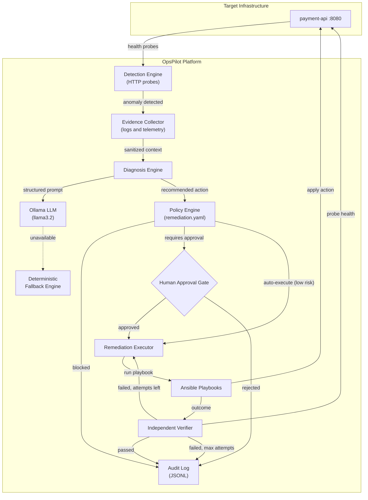
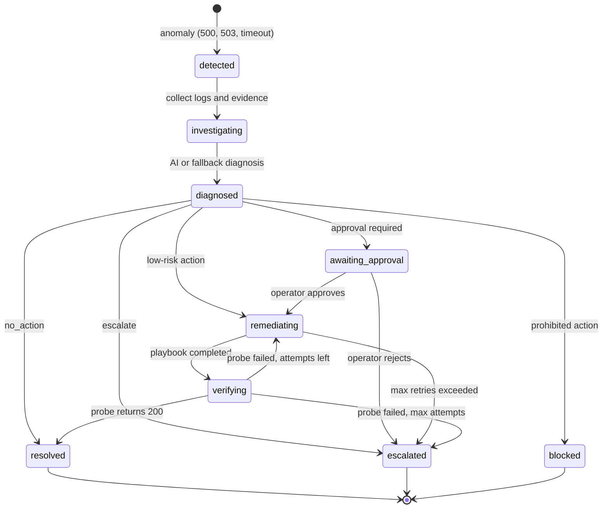

# OpsPilot

**Policy-driven autonomous incident response. The AI diagnoses; a policy engine decides; Ansible executes; an independent verifier checks the result.**

> Detect. Diagnose. Decide. Remediate. Verify.

[](https://www.python.org/)
[](https://fastapi.tiangolo.com/)
[](https://www.docker.com/)
[](https://www.ansible.com/)
[](https://prometheus.io/)
[](tests/)
[](https://github.com/astral-sh/ruff)
[](LICENSE)


---

## Contents

- [What is OpsPilot?](#what-is-opspilot)
- [Why it exists](#why-it-exists)
- [How it works](#how-it-works)
- [Quick start](#quick-start)
- [Try the demo scenarios](#try-the-demo-scenarios)
- [Safety guardrails](#safety-guardrails)
- [Dashboard](#dashboard)
- [REST API](#rest-api)
- [Observability and KPIs](#observability-and-kpis)
- [Project structure](#project-structure)
- [Tech stack](#tech-stack)
- [Testing](#testing)
- [Design decisions (FAQ)](#design-decisions-faq)
- [Contributing](#contributing)
- [License](#license)

---

## What is OpsPilot?

OpsPilot is an open-source platform that watches a service, figures out what went wrong when it breaks, and fixes it automatically, **without ever giving an AI model shell access**.

When an anomaly is detected, OpsPilot:

1. collects sanitized logs and probe results as evidence,
2. asks a local LLM (Ollama, `llama3.2`) for a root-cause diagnosis, falling back to deterministic rules if the model is unavailable,
3. checks the recommended action against a declarative policy (`policies/remediation.yaml`),
4. runs a pre-written Ansible playbook, pausing for human approval when the policy requires it,
5. verifies recovery with its own independent HTTP probe.

The core idea is a hard separation of roles:

```text
AI              -> Analyzes telemetry and logs (advisory only)
Policy Engine   -> Decides what is allowed, at what risk, with what approvals
Ansible         -> Executes pre-tested, immutable playbooks
Verifier        -> Independently confirms the fix (the AI never grades its own work)
```

---

## Why it exists

SRE teams are squeezed from two sides:

- **Slow recovery.** Routine problems such as deadlocked workers, crashed containers, and bad deploys still page someone at 3 AM for a fix that is already well known.
- **Unsafe automation.** Letting an LLM generate and run shell commands in production risks:
  - hallucinated flags that corrupt configuration,
  - destructive commands (`rm -rf`, `DROP TABLE`, deleted cloud resources),
  - retry loops that cascade into cluster-wide outages,
  - no audit trail and no human approval for risky operations.

OpsPilot pairs probabilistic AI reasoning with deterministic controls. The model can only *suggest* an action from an approved list. Everything after that is rules, playbooks, and verification.

**Key properties**

- **AI proposes, policy authorizes.** Recommendations are restricted to a whitelist.
- **Default-deny.** Any unknown or blocked action is rejected immediately.
- **No generated shell.** Only predefined Ansible playbooks are executed.
- **Human approval gates** for actions the policy marks as risky.
- **Independent verification** through active HTTP probes.
- **Bounded retries** (default 3), then automatic escalation to a human.
- **Local and private.** Inference runs on Ollama inside your own infrastructure.

---

## How it works

### Architecture



### Incident lifecycle

Every incident moves through a strict state machine, and invalid transitions are rejected.



---

## Quick start

### Prerequisites

- Docker and Docker Compose
- `curl`
- Python 3.12+ (only if you want to run the tests locally)

### 1. Clone and start the stack

```bash
git clone https://github.com/anggapbwr/OpsPilot.git
cd OpsPilot

docker compose up -d --build
docker compose ps
```

### 2. Pull the LLM (one-time)

```bash
docker exec ollama ollama pull llama3.2
```

OpsPilot works without this step. It simply uses the deterministic fallback engine until the model is available.

### 3. Open the services

| Service | URL | Purpose |
|---|---|---|
| OpsPilot Dashboard | http://localhost:8000/dashboard | Operations UI |
| API docs (Swagger) | http://localhost:8000/docs | Interactive OpenAPI reference |
| Target microservice | http://localhost:8080 | `payment-api` sandbox |
| Prometheus | http://localhost:9090 | Metrics and alerts |

The fastest way to see OpsPilot work is to open the dashboard and click one of the failure buttons in the **Simulator** panel.

---

## Try the demo scenarios

Five scripted scenarios cover the core behaviors. Each is available for PowerShell and Bash.

```bash
# Linux / macOS
chmod +x ./scripts/demo.sh
./scripts/demo.sh all
```

```powershell
# Windows PowerShell
.\scripts\demo.ps1 -Scenario all     # run everything
.\scripts\demo.ps1 -Scenario 3       # or a single scenario (1-5)
```

| # | Scenario | What it proves | Final status |
|---|---|---|---|
| 1 | AI auto-remediation | Ollama diagnoses an HTTP 500 spike, policy auto-approves a low-risk restart, the verifier confirms recovery | `RESOLVED` |
| 2 | AI unavailable | With Ollama down, the fallback engine still produces a diagnosis and the incident is fixed | `RESOLVED` |
| 3 | Rogue AI blocked | A recommendation of `delete_resource` is rejected by policy (HTTP 403) and Ansible is never invoked | `BLOCKED` |
| 4 | Persistent failure | After 3 failed attempts the pipeline stops retrying and pages a human | `ESCALATED` |
| 5 | Bad deployment | A faulty v2.0.0 release triggers a rollback that waits for operator approval | `RESOLVED` after approval |

<details>
<summary><strong>Scenario details</strong></summary>

#### 1. AI auto-remediation
- **Failure:** HTTP 500 spike injected into `payment-api`.
- **Diagnosis:** Ollama analyzes the logs and recommends `restart_container` (`source: ollama`).
- **Policy:** risk `low`, `auto_execute: true`.
- **Remediation:** Ansible runs `restart_container.yml`.
- **Verification:** independent probe returns HTTP 200.

#### 2. AI unavailable (fallback)
- **Condition:** the Ollama container is stopped or unreachable.
- **Diagnosis:** the fallback engine detects the failure and applies deterministic rules (`source: fallback`).
- **Policy and remediation:** same low-risk auto-execute path as scenario 1.
- **Verification:** target restored (HTTP 200).

#### 3. Rogue AI blocked
- **Condition:** the AI recommends `delete_resource`.
- **Policy:** `policies/remediation.yaml` marks it `blocked: true`, `risk: critical`.
- **Result:** execution is refused with HTTP 403, Ansible is never called, and the violation is written to the audit log.

#### 4. Persistent failure and bounded escalation
- **Failure:** a permanent fault on an unresponsive service.
- **Execution:** attempt 1 fails, attempt 2 fails, attempt 3 fails.
- **Result:** `max_attempts: 3` is reached, retries stop to prevent flapping, and the incident is escalated to the on-call engineer.

#### 5. Bad deployment and human approval
- **Failure:** a defective v2.0.0 release makes `payment-api` return HTTP 503.
- **Diagnosis:** the AI identifies a schema migration failure and recommends `rollback_deployment`.
- **Policy:** classified `medium` risk with `requires_approval: true`.
- **Gate:** the pipeline halts at `AWAITING_APPROVAL`.
- **Human action:** the operator reviews the evidence and approves via the dashboard or `POST /api/v1/incidents/{id}/approve`.
- **Remediation:** Ansible runs `rollback.yml` and restores stable v1.0.0.
- **Verification:** independent probe passes.

</details>

---

## Safety guardrails

| Guardrail | How it works | Why it matters |
|---|---|---|
| **Default-deny policy** | An action must be declared in `policies/remediation.yaml` with `allowed: true`. | Unregistered actions are rejected with HTTP 403. |
| **No raw shell execution** | OpsPilot never passes AI output to `subprocess.run`. It only invokes predefined Ansible playbooks. | Removes the shell as an injection target and prevents hallucinated flags. |
| **Strict schema validation** | LLM output must match the `AIDiagnosisOutput` Pydantic schema. | Malformed output falls back to deterministic rules instead of failing open. |
| **Human-in-the-loop gates** | Actions marked `requires_approval` stop at `awaiting_approval` until an operator approves via dashboard or API. | No rollbacks or network changes without consent. |
| **Hard prohibitions** | Dangerous actions (for example `delete_resource`) are marked `blocked: true`. | Never executed, regardless of AI confidence. |
| **Bounded retries** | Remediation stops after a fixed number of attempts (default 3). | Prevents flapping and infinite remediation loops. |
| **Sanitized telemetry** | Regex masking strips tokens, secrets, and API keys before evidence is stored or sent to the LLM. | Reduces the risk of sensitive data reaching logs or prompts. |
| **Audit trail** | Every diagnosis, policy decision, playbook result, and verification is logged as structured JSONL. | Full traceability for compliance reviews. |

---

## Dashboard

A light-theme operations dashboard is served at **http://localhost:8000/dashboard**.

- **Health chips:** live status of the target service (`payment-api`) and the AI provider (Ollama).
- **KPI cards:** total incidents, remediation success rate, MTTR, and policy blocks.
- **Pipeline stepper:** progress across all six stages (Detect, Evidence, Diagnose, Policy, Remediate, Verify).
- **Simulator sandbox:** inject realistic failures:
  - *Bad deployment (v2.0.0, HTTP 503):* triggers `rollback_deployment` and the approval gate.
  - *Service crash / 500 spike:* triggers the auto-restart playbook.
  - *Latency spike (5.0 s):* triggers timeout detection.
- **Approval gate:** one-click **Approve** and **Reject** for pending actions.
- **Evidence drawer:** captured container logs and HTTP probe payloads.
- **Audit trail and incident history:** live tables filterable by severity and status.

---

## REST API

Full interactive documentation is available at `/docs`.

| Method | Endpoint | Description |
|---|---|---|
| `GET` | `/dashboard` | Web operations dashboard |
| `GET` | `/health` | Liveness probe |
| `GET` | `/api/v1/health` | Component readiness check |
| `GET` | `/api/v1/incidents` | List incidents |
| `POST` | `/api/v1/incidents` | Create an incident, or auto-detect one with `auto_detect: true` |
| `GET` | `/api/v1/incidents/{id}` | Incident details, state, and remediation history |
| `POST` | `/api/v1/incidents/{id}/diagnose` | Collect evidence and run AI/fallback diagnosis |
| `POST` | `/api/v1/incidents/{id}/approve` | Approve a gated action |
| `POST` | `/api/v1/incidents/{id}/reject` | Reject the action and escalate |
| `POST` | `/api/v1/incidents/{id}/run` | Run the full autonomous pipeline |
| `POST` | `/api/v1/incidents/{id}/remediate` | Execute a policy-checked playbook |
| `POST` | `/api/v1/incidents/{id}/verify` | Run independent health verification |
| `GET` | `/api/v1/incidents/{id}/audit` | Audit trail for one incident |
| `GET` | `/api/v1/audit` | Global audit log |
| `GET` | `/metrics` | Prometheus scrape endpoint |
| `GET` | `/api/v1/metrics/kpi` | Calculated MTTR and success rate |
| `POST` | `/api/v1/demo/failure` | One-click failure and recovery demo |
| `POST` | `/api/v1/simulator/deployment-failed` | Inject bad deployment (503) |
| `POST` | `/api/v1/simulator/unhealthy` | Inject process crash (500) |
| `POST` | `/api/v1/simulator/latency` | Inject latency spike (timeout) |
| `POST` | `/api/v1/simulator/recover` | Reset the target to healthy (200) |

---

## Observability and KPIs

### Prometheus metrics

| Metric | Meaning |
|---|---|
| `opspilot_incidents_total{type, severity, target}` | Detected anomalies |
| `opspilot_incidents_resolved_total{target, action}` | Successfully resolved incidents |
| `opspilot_incidents_escalated_total{target, reason}` | Incidents escalated to humans |
| `opspilot_remediation_attempts_total{action, target}` | Remediation executions |
| `opspilot_remediation_success_total{action, target}` | Successful playbook runs |
| `opspilot_remediation_failure_total{action, target}` | Failed playbook runs |
| `opspilot_remediation_duration_seconds{action}` | Histogram of remediation runtime |
| `opspilot_active_incidents` | Gauge of non-terminal incidents |

### Operational KPIs (`/api/v1/metrics/kpi`)

- **MTTR:** average seconds from detection to verified resolution.
- **Remediation success rate:** share of playbook executions that ended in verified recovery.
- **Policy block count:** dangerous or unapproved actions intercepted.

---

## Project structure

```text
OpsPilot/
├── app/
│   ├── main.py                 # FastAPI entry point and lifespan
│   ├── orchestrator.py         # Incident lifecycle pipeline
│   ├── dependencies.py         # Dependency injection providers
│   ├── api/                    # REST routes
│   │   ├── routes_health.py        # Health and readiness
│   │   ├── routes_incidents.py     # Incidents, approve, reject
│   │   ├── routes_remediation.py   # Playbook execution and simulator proxy
│   │   └── routes_metrics.py       # Prometheus and KPI endpoints
│   ├── core/                   # Config, logging, metrics, exceptions
│   ├── models/                 # Pydantic schemas (Incident, Diagnosis, Policy, Audit)
│   ├── detection/              # Anomaly detection and HTTP health checks
│   ├── evidence/               # Telemetry collection and log sanitization
│   ├── diagnosis/              # Ollama client and deterministic fallback
│   ├── policy/                 # Declarative policy engine
│   ├── remediation/            # Ansible runner and playbook mapping
│   ├── verification/           # Independent post-remediation validator
│   ├── audit/                  # Structured JSONL audit logger
│   └── static/dashboard.html   # Single-page dashboard
├── ansible/
│   ├── ansible.cfg
│   ├── inventory/hosts.yml
│   └── playbooks/
│       ├── restart_container.yml   # Restart the container
│       ├── restart_service.yml     # Restart the in-container process
│       ├── rollback.yml            # Roll back a deployment
│       └── verify_service.yml      # Post-remediation verification
├── policies/
│   └── remediation.yaml        # Policy rules and constraints
├── simulator/sample-api/       # payment-api target with fault injection
├── monitoring/prometheus.yml   # Prometheus scrape config
├── scripts/
│   ├── demo.ps1                # End-to-end demo (PowerShell)
│   └── demo.sh                 # End-to-end demo (Bash)
├── tests/
│   ├── unit/                   # Policy, diagnosis, incident, verification
│   └── integration/            # Pipeline and extended scenarios
├── docker-compose.yml
├── Dockerfile
├── pyproject.toml              # Package config and Ruff settings
└── README.md
```

---

## Tech stack

| Layer | Technology |
|---|---|
| Backend | Python 3.12+, FastAPI, Pydantic v2, Uvicorn |
| Automation | Ansible (`ansible-core`, `community.docker`) |
| Containers | Docker, Docker Compose |
| Observability | Prometheus |
| Local AI | Ollama (`llama3.2`) with deterministic fallback |
| Quality | Pytest, pytest-asyncio, Ruff |
| Frontend | Vanilla HTML5, CSS3, ES6 with Lucide icons |

---

## Testing

All 35 unit and integration tests pass.

```bash
pytest tests/ -v                      # run the suite
ruff check app/ tests/ simulator/     # lint
```

| Test file | Covers |
|---|---|
| `tests/unit/test_policy.py` | Whitelist validation, blocked rules, attempt limits, approval requirements |
| `tests/unit/test_diagnosis.py` | Schema validation, action whitelisting, confidence constraints |
| `tests/unit/test_incident.py` | Valid and invalid state transitions |
| `tests/unit/test_verification.py` | Verification delays, retry logic, independent probes |
| `tests/integration/test_incident_pipeline.py` | Happy path, repeated-failure escalation, policy blocking, fallback diagnosis |
| `tests/integration/test_scenarios_extended.py` | Approval gate, operator rejection, latency recovery, gate API endpoints |

---

## Design decisions (FAQ)

**Why Ollama instead of OpenAI or other cloud APIs?**
Logs, container output, and stack traces often contain internal IPs, metadata, or proprietary paths. Running the model locally keeps that data inside your network.

**Why Ansible instead of custom Python scripts?**
Playbooks are idempotent, declarative, version-controlled, and widely understood. Remediation steps stay tested and auditable rather than being generated on the fly.

**Why can't the AI run commands directly?**
LLMs are probabilistic. Giving one shell access in production creates serious security and reliability risks, so OpsPilot treats the model as an advisor and keeps authorization and execution deterministic.

**Why an independent verifier?**
An agent that judges its own fix is biased toward declaring success. The verifier probes the service from outside the remediation loop.

---

## Contributing

Contributions are welcome.

1. Fork the repository.
2. Create a feature branch: `git checkout -b feature/amazing-feature`
3. Make sure `pytest tests/` and `ruff check .` both pass.
4. Commit: `git commit -m "Add amazing feature"`
5. Push: `git push origin feature/amazing-feature`
6. Open a Pull Request.

---

## License

Distributed under the MIT License. See [`LICENSE`](LICENSE) for details.
